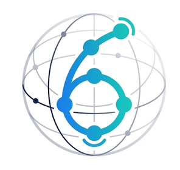

<p align="center"></p>

# Six Degrees of Wikipedia — plotter map

Name two Wikipedia topics. The app finds a chain of links connecting them, draws it as a map with extra branches hanging off each page, and exports an SVG (one layer per pen) ready for a pen plotter, or a JPG preview.

Everything runs in the browser against the public Wikipedia API. There is no build step and no backend.

## Run it

```bash
python3 -m http.server 8000
```

Then open <http://localhost:8000/>. Any static file server works. The live site is at <https://six.bobsabayesian.io>.

The only external dependency is [d3](https://d3js.org/) v7, loaded from a CDN, so you need an internet connection.

## Using it

1. **From / To** – type two topics (autocomplete suggests articles). Optionally press **+ Add via topic** to force the path through extra pages, in order.
2. **Find connection** – a bidirectional search looks for the connection (outgoing links from the start, incoming links to the end). The map grows live while it searches; **Stop** cancels.
3. Adjust the map, then **Download SVG** (for the plotter) or **Download JPG** (preview, with a width in pixels).

## Controls

| Panel | What it does |
|---|---|
| **Search** | Max expansions and frontier cap. Higher values find shorter paths but make more API requests. |
| **Ignore list** | Pages to leave out (one per line, redirects like “NYT” resolved). Ignored pages never appear as branches and the search won't route through them. |
| **Branches** | Branches per path node, per end node, sub-branches per branch, optional cross-links between known pages. The layout seed (🎲) gives reproducible variations. |
| **Paper & style** | Paper from postcard to A1 (plus Letter/Tabloid/custom), orientation, margin, node radii (ends vs. path vs. branches), font size, end-label scale, curved edges, node fill style (rings or hatching). |
| **Stroke font / wrapping** | Labels are drawn with single-stroke Hershey fonts so they plot as real pen lines. Separate wrap widths for satellite labels and path labels (0 = off; long titles are then truncated). |
| **Title** | Optional credit line (see [Licence](#licence)), optional title and subtitle (auto: “A to B”, “N degrees of separation”), top or bottom, alignment, size, font. |
| **Pens** | Define pens (colour + line width in mm), then assign one to every element: title, subtitle, start / end / via / path nodes and labels, branch and sub-branch nodes, edges and labels, cross-links, page border, and node fills (none by default). |

### Editing the map

- **Drag** any node or label to nudge it. Click one and use the **arrow keys** (Shift = bigger steps). Double-click to reset it. Moving one item doesn't disturb the rest of the layout.
- **Click** an element to open its edit bar: change the label text (Enter = new line), force 1/2/3 lines, scale text or node size, hide/show the label, or **Ignore page**.
- **On a phone or tablet** the map stays pinned at the top while you scroll through the settings below it, so changes show live. Drag nodes and labels with your finger; tapping one opens the edit bar as a bottom sheet with on-screen nudge buttons.
- Labels are automatically placed to avoid each other, node circles, edges, the title and the margins.

Nudges and per-element edits are kept in memory only: they are cleared by a new search (and nudges by 🎲 / changing the seed), and lost on reload. Pen assignments and settings are saved in your browser's localStorage.

## Plotting

The SVG is in millimetres at the chosen paper size, with **one layer per pen**, named `1 Black`, `2 Red`, … — the naming Inkscape and the AxiDraw extension use for multi-pen plots. Layer order is pen order, and each layer carries the pen's colour and stroke width. Text is already stroke paths, so no text-to-path conversion is needed. Elements assigned to “— none —” are omitted.

## Notes and limits

- The path is close to shortest but not guaranteed to be: the search caps how many pages it expands per step and how much of a heavily linked page it reads. Raise **Frontier cap** / **Max expansions** to search harder.
- With via topics each leg is searched separately, so the total isn't guaranteed shortest through those stops.
- Wikipedia may rate-limit heavy use (HTTP 429). The app waits and retries; the log shows when it does.
- Label text is limited to basic ASCII for the stroke fonts. Accents are stripped (é → e) and a few characters are mapped (ø → o, – → -); other characters are dropped.

## Files

- `index.html`, `style.css` – the app interface.
- `app.js` – Wikipedia search, graph building, layout (d3-force), label placement, SVG rendering, UI.
- `fonts.js` – vendored Hershey single-stroke font data.
- `assets/` – logo and favicon.
- `LICENSE` – PolyForm Noncommercial 1.0.0.

## Licence

Licensed under the [PolyForm Noncommercial License 1.0.0](LICENSE). In plain terms: you may use, modify and share this software for **noncommercial** purposes (personal projects, hobby plotting, research, education, gifts). **Commercial use, including selling prints, SVGs or products made with it, or offering it as a paid service, needs a separate commercial licence.** To ask for one, open an issue at <https://github.com/bobsabayesian/six-degrees-wikipedia/issues>.

Maps you make for yourself are yours to plot and share. To help people trace where a map came from:

- Exports include a small **credit line** in the corner of the drawing (“Made with Six Degrees of Wikipedia - six.bobsabayesian.io”) and credit/licence **metadata** inside the SVG. The credit line is on by default and can be turned off in the Title panel for your own personal use. Please leave it on if you share or publish a map.
- Link data comes from Wikipedia, whose own licence ([CC BY-SA](https://creativecommons.org/licenses/by-sa/4.0/)) applies to its content.

## About / get a print

See <https://bobsabayesian.io> (linked from the app) for why this project exists and how to request a print through [Ko-fi](https://ko-fi.com/bobsabayesian).

## Credits

Hershey font data via the MIT-licensed [`hersheytext`](https://github.com/techninja/hersheytext) package (original Hershey data © US NBS, as redistributed by Evil Mad Scientist; these notices must be kept). Inspired by [wikipedia-map](https://github.com/controversial/wikipedia-map).
